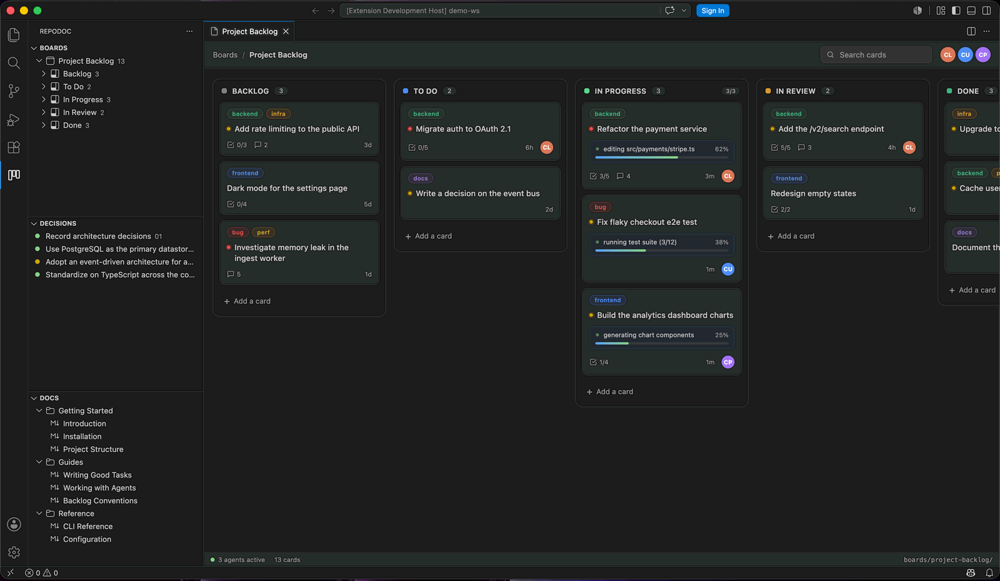
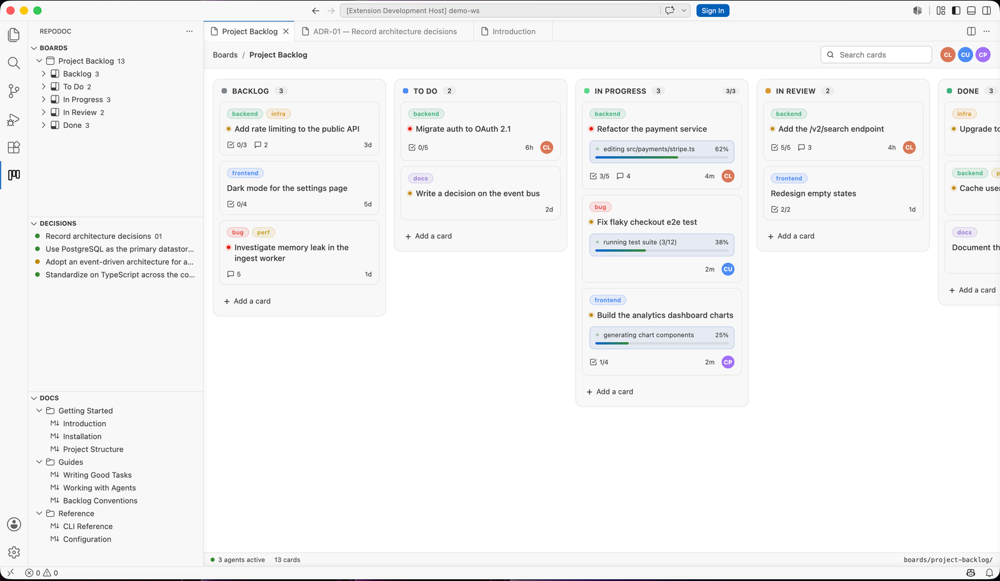
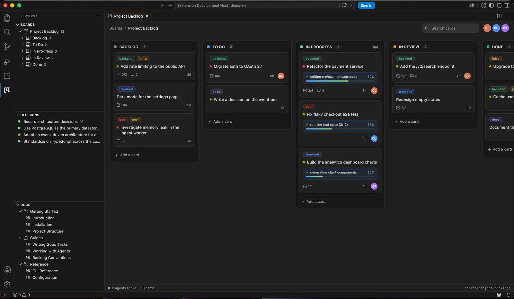
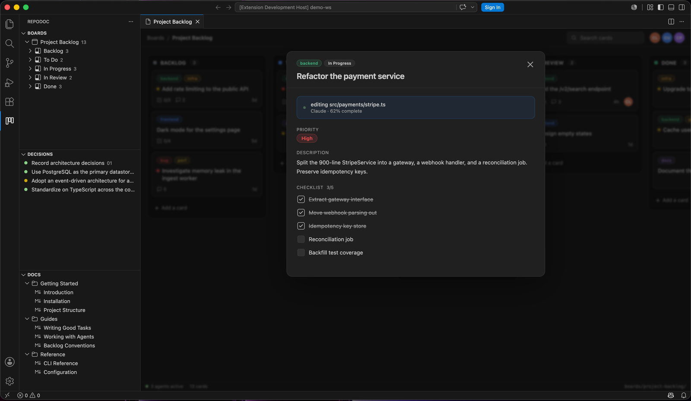
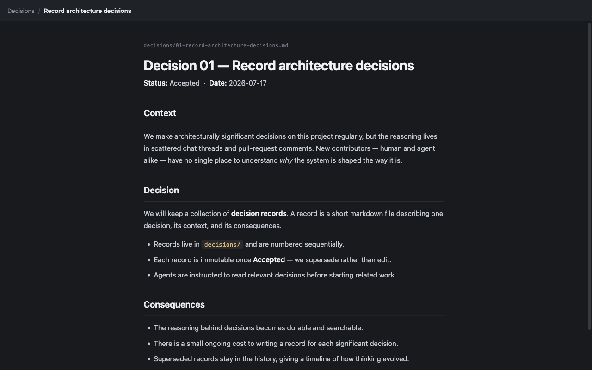
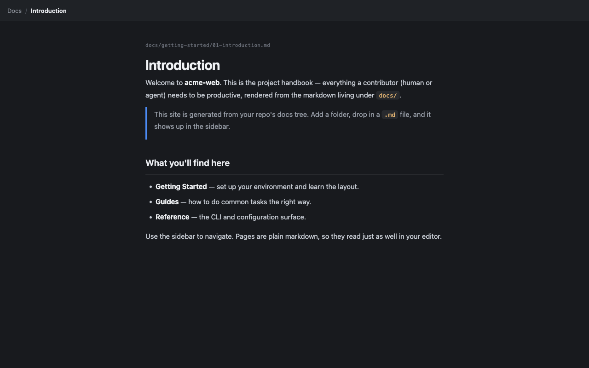

# RepoDoc — run your project from inside the repo

**Be the PM and tech lead of your codebase while coding agents do the work.** RepoDoc gives VS Code a kanban board, decision records, and a documentation site — all stored as plain markdown and JSON in your repository, so the agents working in your repo can pick up tickets, report live progress, record decisions, and keep the docs current. You review, prioritize, and steer.

## Why files in the repo?

Because that's where your agents already are. There's no server, no account, no sync — a card is a markdown file, a decision is a markdown file, the board is a folder. Anything that can edit files (Claude Code, Cursor, Copilot, or you with `vim`) can move work forward, and every change is versioned with the code it describes.

- **Diffable & reviewable** — planning changes show up in pull requests.
- **Agent-native** — assigning a ticket is telling your agent to edit a file.
- **Portable** — clone the repo, get the whole project brain.

## Native to your editor

RepoDoc looks and feels like part of VS Code, not an app in a webview. Navigation is native tree views — every board expands to its columns and cards, so any card is one click away — and every surface follows your color theme, light, dark, or custom:

## The board

Trello-style columns with drag & drop, WIP limits, labels, priorities, search, and per-agent filters. Cards assigned to an agent show a **live status line and progress bar** while the agent works.

Click a card for the full picture — priority, live agent status, description, and checklist:

## Decision records

Capture the *why* behind architectural choices as numbered markdown records with a status lifecycle (Proposed → Accepted → Superseded). Agents read them before touching related code.

## Docs

A Docusaurus-style handbook rendered from your `docs/` tree. Add a folder, drop in a `.md` file, and it shows up in the sidebar — numeric prefixes control the order.

## Getting started

1. Install RepoDoc and open your repository.
2. Click the RepoDoc icon in the activity bar and hit **Initialize RepoDoc** — you get a starter board, a first decision record, and a docs page.
3. Open the board, add cards, and point your coding agent at the repo.

Everything lives in four places:

| Path | Contents |
| --- | --- |
| `boards/<board-id>/NN-slug.md` | One card per file — frontmatter holds column, labels, priority, agent, live status |
| `boards/<board-id>/.config.json` | Board name, columns, WIP limits, labels, agents |
| `decisions/NN-slug.md` | Decision records — frontmatter `status:` and `date:` |
| `docs/NN-slug.md` | Documentation tree (numeric prefix orders the sidebar) |

## Working with agents

Tell your agent the conventions once (or drop them in your agent instructions file):

- Pick up a card by setting `agent: <you>` and `column: doing` in its frontmatter.
- Report progress with `live: true`, `status: <one-liner>`, `progress: 0-100`.
- Tick checklist items (`- [x]`) as you complete them.
- Made a significant choice? Add the next `decisions/NN-*.md` and link it from the card.

RepoDoc watches the files and updates the board live.

### Teach your agent (skill files)

Run **RepoDoc: Install Agent Skill** from the command palette to drop a `repodoc-workflow` skill into `.claude/skills/` (Claude Code) or `.opencode/skill/` (OpenCode). It teaches the agent the whole workflow above — claiming cards, reporting live progress, recording decisions, and keeping docs current. The extension treats installed skill files as managed: it rewrites them to the latest bundled version on activation, so don't hand-edit them (local changes are overwritten).

## Development

`npm install`, then `F5` for an Extension Development Host. `npm run compile` type-checks, lints, and bundles; `npm test` runs the unit suite (on an in-memory filesystem) and the e2e suite (driving the real extension). Releases are cut by tagging `v*` — CI packages the VSIX and attaches it to the GitHub release.

## License

[MIT](LICENSE)
