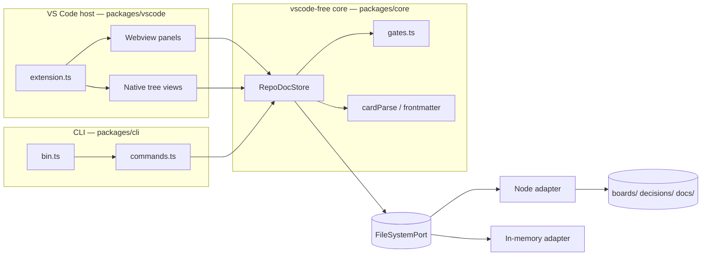

# Architecture

RepoDoc is one vscode-free core with two thin hosts: the VS Code extension and
the `repodoc` CLI. The guiding rule: business logic lives in `packages/core` and
never imports `vscode` or a node built-in; hosts parse input, call the store,
and render.

## Layout

| Location | Responsibility |
| --- | --- |
| `packages/core/src/**` | `@repodoc/core`: the store and all domain logic — boards, cards, gates, decisions, docs. Pure, ports-only. |
| `packages/core/src/adapters/**` | Port implementations: Node filesystem, in-memory filesystem, system clock. |
| `packages/cli/src/**` | `@repodoc/cli`: `repodoc <group> <command>`. Arg parsing, root discovery, output. No runtime dependencies. |
| `packages/vscode/src/panels/**` | Webview panels — the kanban board and the markdown reading view. |
| `packages/vscode/src/trees.ts` | The Boards / Decisions / Docs tree views in the activity bar. |
| `packages/vscode/src/extension.ts` | Activation — wires adapters, store, panels, trees, commands, and file watchers. |
| `packages/vscode/media/**` | Webview assets (CSS/JS) for the board and reading views. |

## Ports & Adapters

The core talks to the outside world only through two ports in
`packages/core/src/ports.ts`: `FileSystemPort` (`exists`, `readFile`,
`writeFile`, `listDir`, `rename` over workspace-relative paths) and `ClockPort`
(`now()`). `RepoDocStore` is constructed with those ports, so both hosts run it
on the Node adapter and tests run it on the in-memory adapter. See
[Decision 03](../../decisions/03-ports-and-adapters-around-file-io.md).

The store keeps board logic itself and delegates decisions and docs to focused
stores — `DecisionStore` and `DocStore`. Parsing helpers are split out too:
`frontmatter.ts`, `cardParse.ts`, `boardConfig.ts`, `ordering.ts`, `naming.ts`,
and `gates.ts`.

## Two hosts, one store

The extension and the CLI construct the same `RepoDocStore` over a
`NodeFileSystemAdapter` rooted at the workspace. Everything an agent does from a
terminal — create, move, comment, record gate evidence — takes the same code
path as a drag on the board, so files always come out in the same shape. See
[Decision 09](../../decisions/09-one-core-two-hosts.md).

The CLI is deliberately dependency-free and imports the core by relative path so
`bunx github:flying-dice/repodoc` can run it straight from a git checkout with no
build or install step.

## Where data lives

Nothing is stored in a database. Boards are folders under `boards/`, decisions
are files under `decisions/`, docs are a tree under `docs/`. File watchers in the
extension call `notifyExternalChange()` on the store when those files change on
disk — so a CLI command run by an agent shows up in the board live. See
[Decision 02](../../decisions/02-store-project-data-as-files.md).

## At a glance

